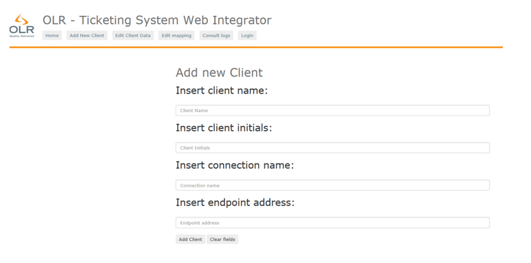
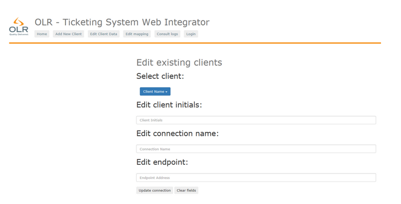
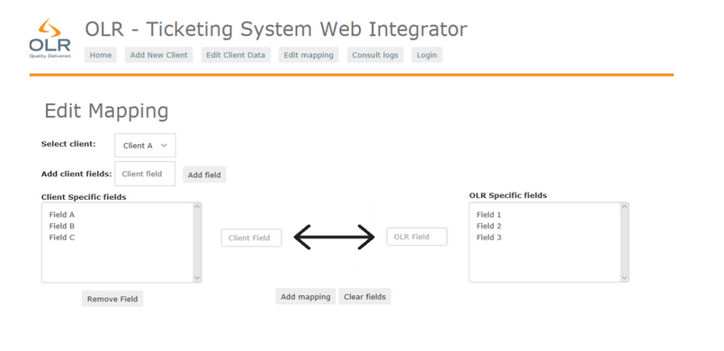
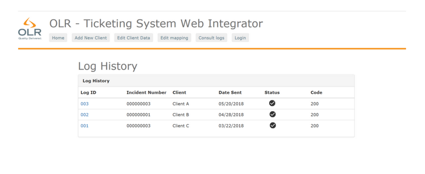

# Ticketing-Integration-System-FrontEnd

The Front End of the Ticketing System Integration Platform consists of a Single Page Application developed using AngularJS and Node.js. 
The SPA allows the users to perform the following actions:

#Add Client

#Edit Client 

#Edit Mapping 

#View Log History

